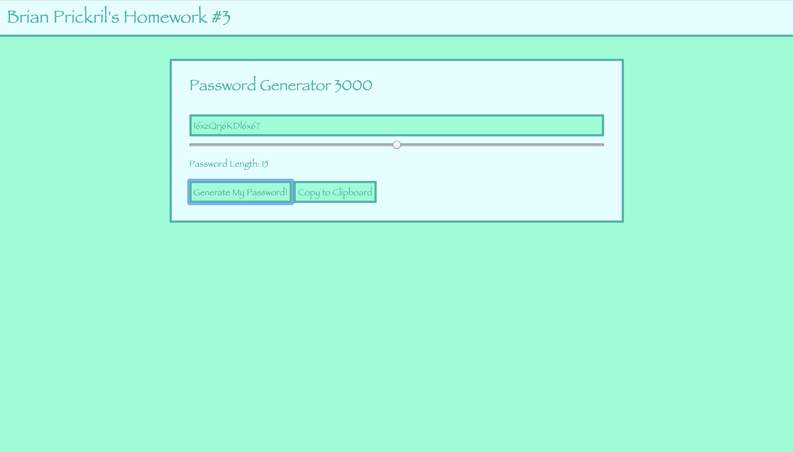

# 03-Password-Generator
A tool that generates random characters for passwords using JavaScript.

Using the slider, you can set the desired length for you password. Then when ready, you can press the generate password button to create your password.

Once you get a passowrd that you like, you can use the copy button to copy the password to the clipboard.

